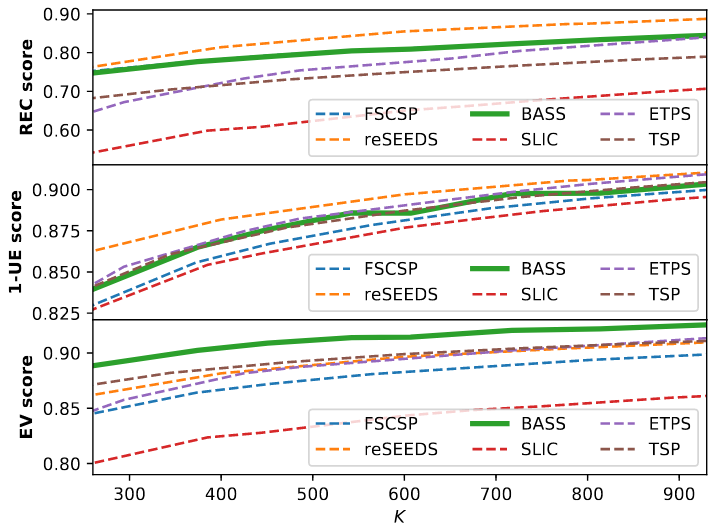

# SLIC-CUDA-C

> Altin Thartori, github.com/tin-z


Examples with M:10,20 K:50,400,1000


---


### Docs ###

 1. [ref](#refs)
 2. [Compilation](#compilation)
 3. [Testing with nvprof](#testing-with-nvprof)
 4. [Correctness and performance](#correctness-and-performance)


---


#### Refs ####
 - [SLIC Superpixels paper](https://www.researchgate.net/publication/225069465_SLIC_Superpixels_Compared_to_State-of-the-Art_Superpixel_Methods)
 - [SLIC Superpixels code](https://github.com/PSMM/SLIC-Superpixels)


---


#### Compilation ####

To compile this program you need to launch nvcc as follows:
```
# Compile slic global memory version
> nvcc -D DEBUG -O3 -arch=sm_20 slic.cu cimage/imagebmp.c converter.cu -o slic

# shared memory version
> nvcc -D DEBUG -O3 -arch=sm_20 slic_smem.cu cimage/imagebmp.c converter.cu -o slic

# bitmap version
> nvcc -D DEBUG -O3 -arch=sm_20 slic_bitmap.cu cimage/imagebmp.c converter.cu -o slic

# much more syncronization version
> nvcc -D DEBUG -O3 -arch=sm_20 slic_sync.cu cimage/imagebmp.c converter.cu -o slic
```


---


#### Testing with nvprof ####

 - Time that took executing the kernels:
```
> nvprof ./slic  
```

 - Print branch efficiency, that can be used as misure to warp divergence:
```
> nvprof --metrics branch_efficiency ./slic
```

 - Occupancy, it's the ratio of active warps to maximum number of warps, per SM:
```
> nvprof --metrics achieved_occupancy ./slic
```

 - Check the global memory load and store efficiency:
```
> nvprof --metrics gld_efficiency,gst_efficiency ./slic
```


---


#### Correctness and performance ####

 - Results on the BSDS500 dataset, Boundary Recall (Rec), Undersegmen-tation Error (UE), Explained Variation (EV)

| K | Rec | 1 - UE | EV |
| ------ | ------ | ------ | ------ |
|  179 |  0.649457 |  0.824345 |   0.78907 |
|  256 |  0.687341 |  0.848753 |  0.814722 |
|  368 |  0.726158 |  0.866343 |  0.825903 |
|  580 |  0.774706 |  0.888233 |  0.849076 |
|  734 |  0.799022 |   0.89772 |  0.862995 |
| 1020 |  0.830591 |  0.908587 |  0.875847 |
| 1227 |  0.849154 |  0.914359 |   0.88348 |
| 1227 |  0.849154 |  0.914359 |   0.88348 |
| 1507 |  0.869528 |  0.919703 |  0.890568 |

The results are similar to the original version, as we can note here (the image is taken from [BASS](https://www.cs.bgu.ac.il/~orenfr/BASS/Uziel_ICCV_2019.pdf))


---

 - Comparison complexity t (best-case)

| Main function | CPU t | GPU t |
| ------ | ------ | ------ |
| Initialization | O(k) | O(1) |
| Assignment | O(Nk) | O(k) |
| Update | O(N) | O(S^2) |
| ------ | ------ | ------ |
| Total complexity | O(INk) | O(IN) |
 


 - Comparison SLIC C++ and CUDA (in millisec) (M:40)

| Arch | K:300 | K:600 | K1000 |
| ------ | ------ | ------ | ------ |
| cpu  |  1757.07  |  1845.61  |  1867.60  |
| gmem |  579.45   |  1119.96  |  1850.44  |
| smem |  631.14   |  1185.85  |  1925.07  |
| sync |  579.37   |  1119.96  |  1850.46  |
| bitm |  579.40   |  1119.97  |  1850.46  |


 - Occupancy ratio (M:40, K:1000)

| Arch |         Main functions             |
|      | initClusters | assignment | update |
| gmem | 0.08 | 0.80 | 0.08 |
| smem | 0.08 | 0.80 | 0.04 |
| sync | 0.08 | 0.80 | 0.08 |
| bitm | 0.08 | 0.80 | 0.08 |


 - Branch efficiency (less warp divergence level, M:40, K:1000)
| Arch |         Main functions             |
|      | initClusters | assignment | update |
| gmem | 92.83 | 99.99 | 99.87  |
| smem | 92.83 | 99.97 | 100.00 |
| sync | 92.83 | 99.99 | 99.87  |
| bitm | 92.83 | 99.99 | 99.86  |
 

 - Global memory Load(L) and store(S) efficiency
| Arch |         Main functions             |
|      | initClusters | assignment | update |
| gmem | 7.02 </br> 100.00 | 96.29 </br> 68.84 | 3.61 </br> 96.72 |
| smem | 7.02 </br> 100.00 | 96.31 </br> 68.84 | 41.88 </br> 98.43 |
| sync | 7.02 </br> 100.00 | 96.35 </br> 68.84 | 3.60 </br> 96.63 |
| bitm | 7.02 </br> 100.00 | 96.28 </br> 68.84 | 3.60 </br> 96.64 |


---


